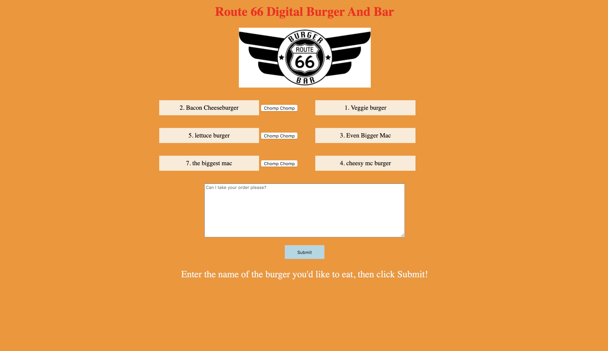
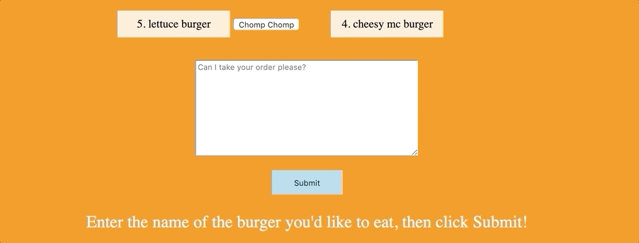
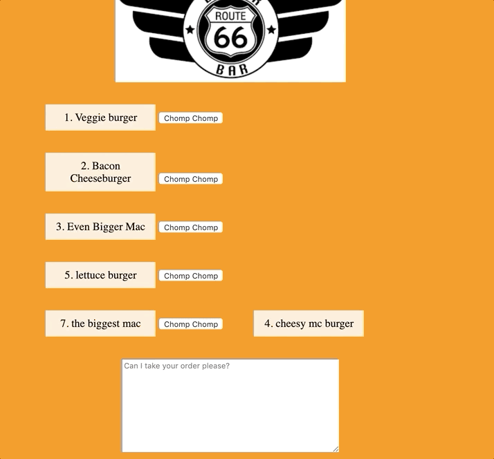

# burger_eater
An app build to showcase use of express with handlebars and mysql

This is an app built in Node, using the templating engine handlebars to create a virtual diner where users can order, and then eat, a collection of custom burgers. The information related related to each burger is stored in a mysql database.  

Burger_eater is designed to show an understanding of RESTful routing, along with node,express and handlebars. I enjoyed creating the routes for this project, as well as getting a chance to gain a deeper understanding of how to implement the MVC model. 

I found the most difficult part of this project to be adapting the app to follow the MVC, thoygh this part was also quite interesting, and rewarding once it began to function correctly.

See an example of the app working below.

The app with half the burgers eaten, and the other half waiting to be consumed, populated with GET request.

Adding a burger using a POST request: the burger is also added to a MySql database.

Updating burgers to be eaten using a PUT request.

